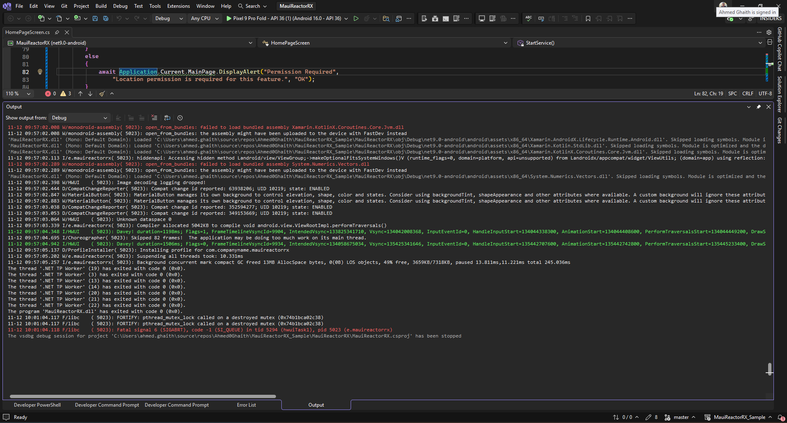
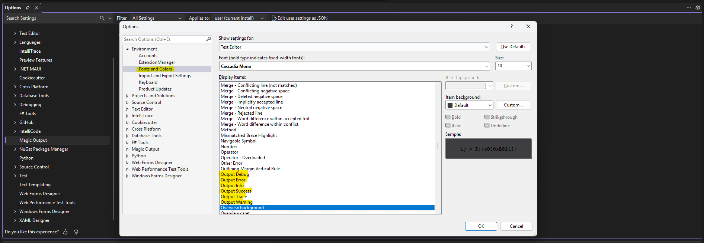

# 🎨 Magic Output

**Colorize Your Visual Studio Output Window for Better Readability!**

Magic Output automatically adds color highlighting to the Visual Studio Output window, making it easier to spot errors, warnings, and important messages at a glance.

 
## ✨ Features

- 🔴 **Errors** - Bright red highlighting for errors, exceptions, and failures
- 🟠 **Warnings** - Orange highlighting for warnings and deprecated items
- 🟢 **Success** - Green highlighting for successful operations and completions
- 🔵 **Info** - Blue highlighting for informational messages
- ⚪ **Debug** - Gray highlighting for debug and verbose output
- 🟣 **Trace** - Purple highlighting for trace messages
- ⚙️ **Customizable** - Add your own custom patterns for warnings and errors via Options dialog
- 🎯 **Easy Access** - Quick access to options via Tools menu

## 🚀 Installation

### From Visual Studio Marketplace
1. Open Visual Studio
2. Go to **Extensions → Manage Extensions**
3. Search for **"Magic Output"**
4. Click **Download** and restart Visual Studio

### Manual Installation
1. Download the latest `.vsix` file from [Releases](https://github.com/ahmed0ghaith/MagicOutput/releases)
2. Close all Visual Studio instances
3. Double-click the `.vsix` file
4. Follow the installation wizard
5. Restart Visual Studio

## 📖 Usage

**Zero configuration required!** Magic Output works automatically once installed.

1. Open any project in Visual Studio
2. Build your project or run any command that generates output
3. Open the **Output window** (View → Output or `Ctrl+Alt+O`)
4. Watch as your output messages are automatically colorized!

### ⚙️ Configuration

Magic Output includes customizable options to enhance your experience:
 
1. **Access Options:**
   - Go to **Tools → Options → Magic Output → General**
   - Or use **Tools → Open Magic Output Options...** from the menu

2. **Customize Patterns:**
   - **Extra Warning Patterns**: Add comma-separated regex terms to extend the default warning detection
     - Example: `deprecated, obsolete, outdated`
   - **Extra Error Patterns**: Add comma-separated regex terms to extend the default error detection
     - Example: `critical, severe, urgent`

3. **Apply Changes:**
   - Click **OK** to save your settings
   - Changes take effect immediately for new output messages

### Smart Pattern Recognition

Magic Output intelligently recognizes patterns in your output:

| Pattern | Color | Examples |
|---------|-------|----------|
| Error | Red | error, exception, failed, failure, fatal, critical |
| Warning | Orange | warning, warn, caution, deprecated |
| Success | Green | success, succeeded, completed, passed, done, OK |
| Info | Blue | info, information, note, starting, building |
| Debug | Gray | debug, verbose |
| Trace | Purple | trace, tracing |

## 🔧 Supported Visual Studio Versions

- ✅ Visual Studio 2026 
- ✅ Visual Studio 2022 (17.x)

## 🤝 Contributing

Contributions are welcome! Here's how you can help:

1. **Fork** the repository
2. **Create** a feature branch (`git checkout -b feat/AmazingFeature`)
3. **Commit** your changes (`git commit -m 'Add some AmazingFeature'`)
4. **Push** to the branch (`git push origin feat/AmazingFeature`)
5. **Open** a Pull Request

### Development Setup

1. Clone the repository
2. Open `MagicOutput.sln` in Visual Studio
3. Ensure you have **Visual Studio Extension Development** workload installed
4. Build the solution (this generates the `.pkgdef` file required for options page registration)
5. Press `F5` to debug (opens experimental VS instance)

### Project Structure

- `MagicOutputPackage.cs` - Main package class with classification logic
- `OutputClassificationOptions.cs` - Options page for user customization
- `Commands.vsct` - Menu command definitions
- `source.extension.vsixmanifest` - VSIX manifest file

## 📝 Recent Updates

### Version 1.0.0
- ✅ Added customizable options page (Tools → Options → Magic Output → General)
- ✅ Added ability to customize warning and error patterns
- ✅ Added menu command to quickly open options (Tools → Open Magic Output Options...)
- ✅ Improved package registration and initialization
- ✅ Enhanced pattern matching with user-defined regex patterns
- ✅ Fixed options page registration to ensure proper display in Visual Studio Options dialog

## 🐛 Known Issues

- Some third-party extensions may conflict with output colorization
- Very large output windows (10,000+ lines) may experience slight lag
- Custom patterns require restart of output window to take full effect

Report issues at: [GitHub Issues](https://github.com/ahmed0ghaith/MagicOutput/issues)

## 💖 Acknowledgments

- Inspired by Output Enhancer and similar productivity tools
- Built with the Visual Studio Extensibility SDK
- Thanks to all contributors and users!

**Made with ❤️ for Visual Studio developers**

If you find Magic Output useful, please ⭐ star the repository and leave a review on the Visual Studio Marketplace!
