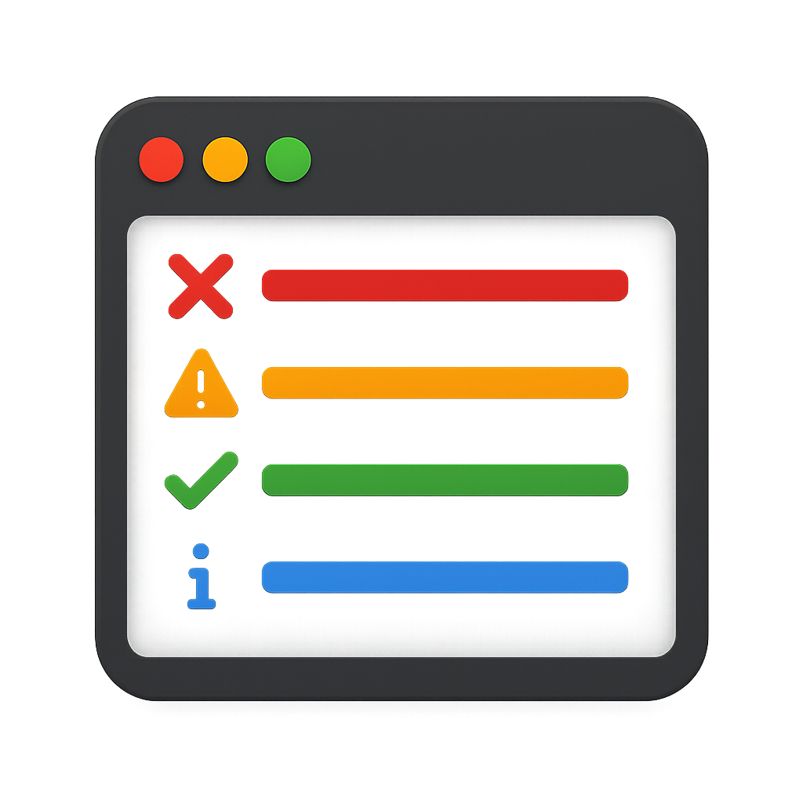

# 🎨 Magic Output

**Colorize Your Visual Studio Output Window for Better Readability!**

Magic Output automatically adds color highlighting to the Visual Studio Output window, making it easier to spot errors, warnings, and important messages at a glance.

## ✨ Features

- 🔴 **Errors** - Bright red highlighting for errors, exceptions, and failures
- 🟠 **Warnings** - Orange highlighting for warnings and deprecated items
- 🟢 **Success** - Green highlighting for successful operations and completions
- 🔵 **Info** - Blue highlighting for informational messages
- ⚪ **Debug** - Gray highlighting for debug and verbose output
- 🟣 **Trace** - Purple highlighting for trace messages

## 🚀 Installation

### From Visual Studio Marketplace
1. Open Visual Studio
2. Go to **Extensions → Manage Extensions**
3. Search for **"Magic Output"**
4. Click **Download** and restart Visual Studio

### Manual Installation
1. Download the latest `.vsix` file from [Releases](https://github.com/ahmed0ghaith/MagicOutput/releases)
2. Close all Visual Studio instances
3. Double-click the `.vsix` file
4. Follow the installation wizard
5. Restart Visual Studio

## 📖 Usage

**Zero configuration required!** Magic Output works automatically once installed.

1. Open any project in Visual Studio
2. Build your project or run any command that generates output
3. Open the **Output window** (View → Output or `Ctrl+Alt+O`)
4. Watch as your output messages are automatically colorized!

### Smart Pattern Recognition

Magic Output intelligently recognizes patterns in your output:

| Pattern | Color | Examples |
|---------|-------|----------|
| Error | Red | error, exception, failed, failure, fatal, critical |
| Warning | Orange | warning, warn, caution, deprecated |
| Success | Green | success, succeeded, completed, passed, done, OK |
| Info | Blue | info, information, note, starting, building |
| Debug | Gray | debug, verbose |
| Trace | Purple | trace, tracing |

## 🔧 Supported Visual Studio Versions

- ✅ Visual Studio 2026 
- ✅ Visual Studio 2022 (17.x)

## 🤝 Contributing

Contributions are welcome! Here's how you can help:

1. **Fork** the repository
2. **Create** a feature branch (`git checkout -b feature/AmazingFeature`)
3. **Commit** your changes (`git commit -m 'Add some AmazingFeature'`)
4. **Push** to the branch (`git push origin feature/AmazingFeature`)
5. **Open** a Pull Request

### Development Setup

1. Clone the repository
2. Open `MagicOutput.sln` in Visual Studio
3. Ensure you have **Visual Studio Extension Development** workload installed
4. Build the solution
5. Press `F5` to debug (opens experimental VS instance)

## 🐛 Known Issues

- Some third-party extensions may conflict with output colorization
- Very large output windows (10,000+ lines) may experience slight lag

Report issues at: [GitHub Issues](https://github.com/ahmed0ghaith/MagicOutput/issues)

## 📄 License

This project is licensed under the MIT License - see the [LICENSE](LICENSE) file for details.

## 💖 Acknowledgments

- Inspired by Output Enhancer and similar productivity tools
- Built with the Visual Studio Extensibility SDK
- Thanks to all contributors and users!

**Made with ❤️ for Visual Studio developers**

If you find Magic Output useful, please ⭐ star the repository and leave a review on the Visual Studio Marketplace!